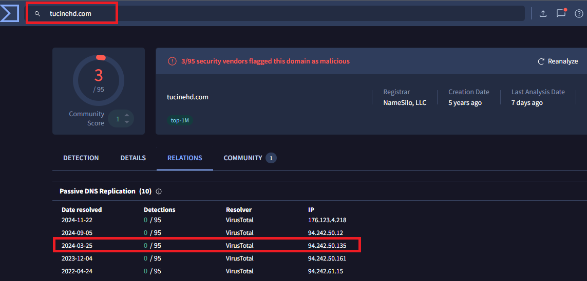
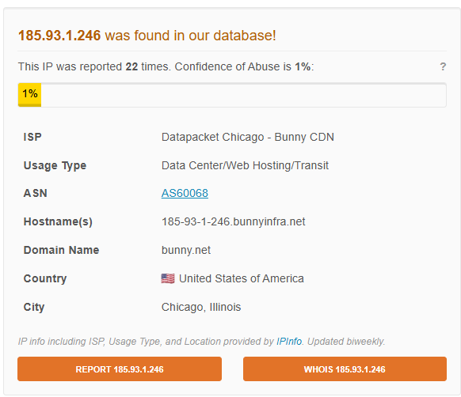

- [Tempo investido](https://github.com/willyamcts/report-ir/README.md#Tempo%20investido)
- [Por que esse cenário](https://github.com/willyamcts/report-ir/README.md#Por%20que%20esse%20cen%C3%A1rio)
- [Cenário da empresa](https://github.com/willyamcts/report-ir/README.md#Cen%C3%A1rio%20da%20empresa)
- [Informações do incidente](https://github.com/willyamcts/report-ir/README.md#Informa%C3%A7%C3%B5es%20do%20incidente)
	- [Ações da TI](https://github.com/willyamcts/report-ir/README.md#A%C3%A7%C3%B5es%20da%20TI)
	- [Contratação de IR](https://github.com/willyamcts/report-ir/README.md#Contrata%C3%A7%C3%A3o%20de%20IR)
- [Análise do Incidente](https://github.com/willyamcts/report-ir/blob/main/analise_do_incidente.md)
- [Análise da campanha](https://github.com/willyamcts/report-ir/blob/main/analise_do_incidente.md)

----------

# Tempo investido

**TOTAL = 36h 55min**

* ~16h de análise
* ~20h 55min para compilação das informações, pesquisas e gerar o relatório

**Detalhamento**

x/10:
* 1h: leitura e coleta de informações do cenário

02/11:
* 1h 15min: análise dos artefatos no VT
* 1h 55min: check PCAP

03/11
* 30min: verificando endereços IPs no VT e AbuseTotal presente no PCAP

08/11:
* 1h 40min: verificando consultas de DNS e IPs retornado das queries (alguns domínios atualmente parecem estar com IP diferente do artefato)
* 1h 35min: correlacionando apontamento de DNS com endereços IPs apontados como suspeitos pelo VT
* 1h 20min: analisando arquivos em geral e requisições HTTP dos artefatos

09/11:
* 50min: iniciando relatório
* 1h 55min: analisando as comunicações HTTP e seus domínios, na respectiva ordem de comunicação

10/11:
* 2h10min: análise dos cabeçalhos e corpo das requisições HTTP

11/11:
* 30min: análise da página mdasidy72.lol

12/11:
* 2h: analisando ps1 e omgsoft.exe no ANY.RUN

13/11:
* 30min: pesquisa sobre Lumma Stealer e Cicada3301
* 40min: compilando infos do ANY.RUN

15/11:
* 40min: pesquisas Repellent Scorpius, Cicada3301
* 1h: estruturando tópico de detalhes
* 1h 10min: escrevendo tópico de soluções pós incidente
* 1h: criando timeline no Canva

16/11:
* 1h 10min: ajustando e incrementando conteúdo no relatório
* 5h 10min: finalizando resumo, detalhes do incidente e iniciado pesquisa para fazer a análise da campanha
* 1h 25min: pesquisa e finalizando a análise da campanha

17/11:
* 1h: iniciando tópico cyber kill chain

TOTAL ATÉ 17/11 = 29h 45 min

18/11:
* 1h: pesquisa e compreensão do LummaC2
* 50min: finalizado detalhes e conclusão da análise
* 30min: finalizando diamond model
* 30min: ajuste análise da campanha
* 1h 20min: finalizando tópico "ciber kill chain"
* 45min: criando tópico "contenção"
* 20min: ajustes de formatação
* 1h 10min: criando tópico "cronograma de recomendações"

19/11:
* 25min: revisão
* 20min: adição tópicos WAF e 2FA

---------

# Por que esse cenário

O mais pesado entre os demais, exceto o 11 que já foi apresentado na aula extra.

----------

# Cenário da empresa

Ativos:
 - Windows Server 2012 R2 - AD
 - Windows Server 2019 - file server e ERP
 - DB MySQL v5.7
 - Mail Zimbra v8.8.12 sem MFA
 - PRTG para monitoramento: configuração limitada, não cobre todos os ativos críticos da rede
 - Veeam Backup & Replication Community Edition

Meio de contenção da empresa:
 - Avast Business Free Edition
 - SonicWall TZ350: regras padrões, sem inspeção de tráfego

Desafios já mapeados antes do incidente:
 - reuso de senhas administrativas
 - permissões inadequadas nos file servers
 - falta de update regular em SO

-------------

# Informações do incidente

* **Lucro da empresa**: R$ 180k/dia - equivalente a R$ 7,5k/hora
* **Data do incidente**: 10/02
* **Causa**: ransomware
* **Paciente 0**: 10.6.24.101
* **Aplicações/servers afetados**: principais + banco de dados

## Ações da TI

**1º ação da TI**: restaurar backup (Veeam)

Resultado ação 1: arquivos corrompidos, 72h inoperante

**Pós ação 1**: detectado tentativas de acesso não autorizado e alteração não registradas em permissões de usuários

**Ação da TI**: não identificado a origem nem extensão

## Contratação de IR

Contratado para:
 1. investigar
 2. identificar impactos
 3. mitigar danos
 4. fornece recomendação estratégica para evitar novos incidentes

------------

# Correlacionando tráfego de rede com arquivos suspeitos

Com base no tráfego coletado, pode-se perceber que o primeiro contato do paciente zero foi com o domínio tucinehd.com, que utiliza o IP 94.242.50.135

Note que o domínio já foi marcado como malicioso por alguns fornecedores de serviços de segurança, porém o IP aparenta não ser nocivo.

---------------

A seguir será listado cada arquivo classificado como nocivo pelo Vírus Total e relacionado ao tráfego de rede que foi coletado.

* 12:39:59 UTC-3 o IP interno `10.6.24.101` acessou `tucinehd.com` com destino a 94.242.50.135.
* O IP atual para `tucinehd.com` = 185.237.100.160, não consta na base do `abuseipdb.com`.

## omgsoft.zip
Conforme [análise do Virus Total](https://www.virustotal.com/gui/file/6608aeae3695b739311a47c63358d0f9dbe5710bd0073042629f8d9c1df905a8/behavior) em conjunto com o PCAP coletado...

* o FQDN utilizado é o `latesttributedowps.shop`
* 24/06/2024 12:42:15 UTC-3 o host `10.6.24.101` fez a consulta de DNS para o domínio `latesttributedowps.shop` que retornou os IPs `172.167.138.40` e `104.21.70.178`
* No mesmo instante começou o download de alguma arquivo do IP `172.167.138.40` para o IP local `10.6.24.101` 

Limpos:
* Google: 142.250.114.95, 142.251.116.132
* Veesp.com: 94.242.50.135
* chatango.com: 208.93.230.26

Avaliar:
* bunny.net: 185.93.1.246

